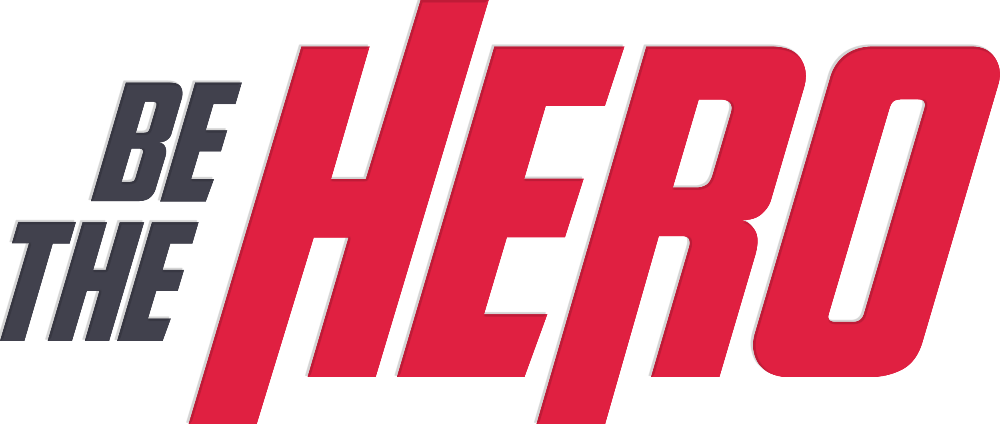

<p align="center">
  
</p>

# 

<p align="center">
  
</p>

<br>

<p align="center">
  <a href="#project-">Project</a>&nbsp;&nbsp;&nbsp;|&nbsp;&nbsp;&nbsp;
  <a href="#techs-rocket">Techs</a>&nbsp;&nbsp;&nbsp;|&nbsp;&nbsp;&nbsp;
  <a href="#extras-slot_machine">Extras</a>&nbsp;&nbsp;&nbsp;|&nbsp;&nbsp;&nbsp;
  <a href="#installation-wrench">Installation</a>&nbsp;&nbsp;&nbsp;|&nbsp;&nbsp;&nbsp;
  <a href="#test-heavy_check_mark">Test</a>&nbsp;&nbsp;&nbsp;|&nbsp;&nbsp;&nbsp;
  <a href="#to-do-newspaper">To Do</a>&nbsp;&nbsp;&nbsp;|&nbsp;&nbsp;&nbsp;
  <a href="#contributing-">Contributing</a>&nbsp;&nbsp;&nbsp;|&nbsp;&nbsp;&nbsp;
  <a href="#license-memo">License</a>
</p>

<br>

## Project 💻

**Be The Hero** connects people who want to help Non Governmental Organizations (NGO). At the platform NGOs can create incidents which they need a <strong>hero</strong> to help. The heroes can search through all the incidents created and choose which one they want to help and contact the NGO.

It was a project made on [Rocketseat](https://github.com/Rocketseat)'s #11 OmniStack Week, with a few changes.

<br>

## Techs :rocket:

- [Node.js](https://nodejs.org/en/);
- [ReactJS](https://reactjs.org);
- [React Native](https://facebook.github.io/react-native/).

<br>

## Extras :slot_machine:

- Email integration (account verification, reset password etc);
- JWT authentication;
- Frontend x Backend Validation.

<br>

## Installation :wrench:

You can install the application server and client using, from the root folder, the following command:

```sh
yarn installapp
```

<br>

If you wish to install the mobile version, from the root folder run the following command:

```sh
yarn installmobile
```
Or, if you use Android, download and install the [.apk](https://github.com/leoronne/BeTheHero/blob/master/mobile/assets/BeTheHero.apk) on your phone

<br>

## Test :heavy_check_mark:

To start the application server on your local machine, from the root folder, just run:

```sh
yarn start
```

<strong>Note: you need to create a .env file on the server directory based on the [example file](https://github.com/leoronne/BeTheHero/blob/master/server/example.env). You can read the documentation of the APIs and test them [here](http://betheehero.herokuapp.com/api-docs/).</strong>

<br>


To start the application client (frontend), from the root folder, just run:

```sh
yarn startclient
```

<br>


<strong>Remember to change the [client](https://github.com/leoronne/BeTheHero/blob/master/client/src/services/api.js) and [mobile](https://github.com/leoronne/BeTheHero/blob/master/mobile/src/services/api.js) api's baseURL to your local server adress (which is set to http://localhost:8080/ at [server/index.js](https://github.com/leoronne/BeTheHero/blob/master/server/src/index.js)) or to your production server.</strong>

<br>

To start the mobile application client you need to install [expo](https://expo.io/learn) on your local machine then, from the root folder, just run:

```sh
yarn installmobile
```

<br>

## To do :newspaper:

- Profile page for NGO insert and detail more about them;
- Create more contact options;
- Filters so that NGO and heroes can search through incidents more efficiently;
- Mark the incidents that have been already solved;
- Interface for the NGOs on the mobile version, in the moment the mobile app only lists all the incidents created and allows you to contact the NGO responsible.

<br>

## Contributing 🤔 

Please read [CONTRIBUTING](https://github.com/leoronne/BeTheHero/blob/master/CONTRIBUTING.md) for details on code of conduct, and the process for submitting pull requests to the project.

<br>

## License :memo:

[](http://badges.mit-license.org)
- **[MIT license](https://github.com/leoronne/BeTheHero/blob/master/LICENSE)**
- Copyright 2020 © <a href="https://github.com/leoronne" target="_blank">Leonardo Ronne</a>.

## 


